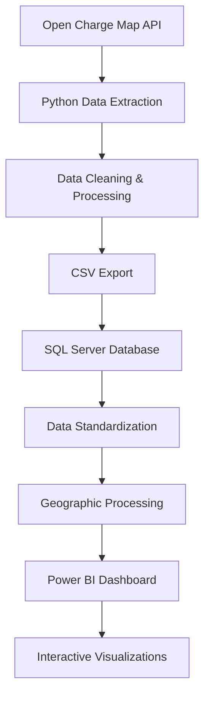

# 🔌 EV Infrastructure Analysis Using Power BI

[](https://python.org)
[](https://powerbi.microsoft.com)
[](https://microsoft.com/sql-server)
[](LICENSE)

A comprehensive data analysis project that extracts, processes, and visualizes Electric Vehicle (EV) charging station data across India using Python, SQL Server, and Power BI. This project provides insights into EV infrastructure distribution, operator analysis, and charging station characteristics.

## 📋 Table of Contents

- [🚀 Features](#-features)
- [📊 Project Overview](#-project-overview)
- [🛠️ Technology Stack](#️-technology-stack)
- [📁 Project Structure](#-project-structure)
- [⚙️ Installation & Setup](#️-installation--setup)
- [🚀 Usage](#-usage)
- [📈 Data Pipeline](#-data-pipeline)
- [📊 Power BI Dashboard](#-power-bi-dashboard)
- [🔍 Key Insights](#-key-insights)
- [📸 Screenshots](#-screenshots)
- [🤝 Contributing](#-contributing)
- [📄 License](#-license)

## 🚀 Features

- **🌐 Real-time Data Extraction**: Fetches live EV charging station data from Open Charge Map API
- **🗄️ Database Integration**: Seamless data storage and management using SQL Server
- **📊 Advanced Analytics**: Comprehensive data cleaning and preprocessing
- **🎨 Interactive Dashboards**: Beautiful Power BI visualizations with state-wise analysis
- **📍 Geographic Analysis**: Location-based insights with geospatial data processing
- **⚡ Charging Infrastructure Insights**: Operator analysis, pricing patterns, and station distribution
- **🔄 Automated Pipeline**: End-to-end data processing workflow

## 📊 Project Overview

This project analyzes India's EV charging infrastructure by:

1. **Data Collection**: Extracting charging station data from Open Charge Map API
2. **Data Processing**: Cleaning, standardizing, and enriching the dataset
3. **Database Storage**: Storing processed data in SQL Server with geographic capabilities
4. **Visualization**: Creating interactive Power BI dashboards for analysis
5. **Insights Generation**: Providing actionable insights for EV infrastructure planning

## 🛠️ Technology Stack

| Component | Technology | Purpose |
|-----------|------------|---------|
| **Data Extraction** | Python 3.8+ | API data fetching and processing |
| **Data Processing** | Pandas, NumPy | Data cleaning and transformation |
| **Database** | SQL Server 2019+ | Data storage and management |
| **Visualization** | Power BI Desktop | Interactive dashboards and reports |
| **Geographic Analysis** | SQL Server Geography | Spatial data processing |
| **API Integration** | Open Charge Map API | Real-time charging station data |

## 📁 Project Structure

```
EV Infrastructure Analysis Using Power BI/
├── 📄 download_clean_data.py          # Data extraction script
├── 📄 openchargemap_station.py        # Comprehensive data fetching
├── 📄 load_database.py                # Database loading utility
├── 📄 requirements.txt                # Python dependencies
├── 📄 openchargemap_stations_clean.csv # Processed dataset
├── 📁 SQL Server/                     # Database scripts
│   ├── 📄 All data updates.sql        # Complete data processing
│   ├── 📄 final_cleaned.sql           # Final data view
│   ├── 📄 Inspect Key Columns for Analysis.sql
│   ├── 📄 Populate the GeoLocation Column.sql
│   ├── 📄 Standardize Unknown Operators.sql
│   └── 📄 Cleaned dataset.csv
├── 📁 Screenshots and live demo/      # Project documentation
│   ├── 🖼️ BI_dashboard.png
│   ├── 🖼️ BI_karnatka.png
│   ├── 🖼️ BI_Kerala.png
│   ├── 🖼️ BI_rajasthan.png
│   ├── 🖼️ BI_TN.png
│   ├── 🖼️ BI_UP.png
│   └── 🎥 Power BI walkthrough.mp4
└── 📁 venv/                          # Python virtual environment
```

## ⚙️ Installation & Setup

### Prerequisites

- **Python 3.8+** with pip
- **SQL Server 2019+** with SQL Server Management Studio
- **Power BI Desktop** (latest version)
- **Open Charge Map API Key** (free registration required)

### 1. Clone the Repository

```bash
git clone <repository-url>
cd "EV Infrastructure Analysis Using Power BI"
```

### 2. Set Up Python Environment

```bash
# Create virtual environment
python -m venv venv

# Activate virtual environment
# Windows
venv\Scripts\activate
# macOS/Linux
source venv/bin/activate

# Install dependencies
pip install -r requirements.txt
```

### 3. Configure API Key

Edit `download_clean_data.py` and `openchargemap_station.py`:

```python
API_KEY = 'your_open_charge_map_api_key_here'  # Replace with your actual API key
```

### 4. Set Up SQL Server Database

1. Create a new database named `EV_India_Analysis`
2. Run the SQL scripts in the `SQL Server/` folder in order:
   - `All data updates.sql` (comprehensive setup)
   - Or run individual scripts as needed

## 🚀 Usage

### Step 1: Extract Data

```bash
# Extract clean, processed data
python download_clean_data.py

# Or extract comprehensive dataset
python openchargemap_station.py
```

### Step 2: Load to Database

```bash
# Load processed data to SQL Server
python load_database.py
```

### Step 3: Create Power BI Dashboard

1. Open Power BI Desktop
2. Connect to your SQL Server database
3. Use the `vw_ChargingStations_Clean` view as your data source
4. Create visualizations based on your analysis needs

## 📈 Data Pipeline



### Data Processing Steps

1. **🌐 API Extraction**: Fetch charging station data from Open Charge Map
2. **🧹 Data Cleaning**: Remove duplicates, handle missing values
3. **📊 Standardization**: Normalize operator names, pricing information
4. **📍 Geographic Processing**: Create spatial data for mapping
5. **💾 Database Storage**: Store in SQL Server with proper indexing
6. **📈 Visualization**: Create interactive Power BI dashboards

## 📊 Power BI Dashboard

The Power BI dashboard includes:

- **🗺️ Geographic Distribution**: Interactive map showing charging station locations
- **📊 State-wise Analysis**: Charging infrastructure by Indian states
- **⚡ Operator Analysis**: Leading charging station operators
- **💰 Pricing Insights**: Cost analysis and pricing patterns
- **📈 Growth Trends**: Infrastructure development over time
- **🔍 Filtering Options**: Dynamic filtering by location, operator, and status

### Key Visualizations

- **Geographic Heat Map**: Station density across India
- **State Comparison Charts**: Infrastructure comparison between states
- **Operator Market Share**: Leading operators and their distribution
- **Pricing Analysis**: Cost patterns and free vs. paid stations
- **Status Overview**: Operational vs. non-operational stations

## 🔍 Key Insights

### Infrastructure Distribution
- **Geographic Coverage**: Stations across major Indian cities and highways
- **State-wise Analysis**: Karnataka, Kerala, Tamil Nadu, and other states
- **Urban vs. Rural**: Distribution patterns in metropolitan areas

### Operator Analysis
- **Leading Operators**: Tata Power, JIO BP Pulse, and other major players
- **Market Penetration**: Operator presence across different regions
- **Service Quality**: Operational status and reliability metrics

### Charging Characteristics
- **Connection Types**: CCS, CHAdeMO, and Type 2 connectors
- **Power Levels**: Fast charging capabilities and power ratings
- **Pricing Models**: Free vs. paid charging stations

## 📸 Screenshots

| Dashboard View | Description |
|----------------|-------------|
|  | **Main Dashboard**: Overview of EV charging infrastructure across India |
|  | **Karnataka Focus**: Detailed analysis of charging stations in Karnataka |
|  | **Kerala Analysis**: EV infrastructure insights for Kerala state |
|  | **Rajasthan Focus**: Charging station distribution in Rajasthan |
|  | **Tamil Nadu Analysis**: Infrastructure overview for Tamil Nadu |
|  | **Uttar Pradesh Focus**: EV charging network in UP |

## 🤝 Contributing

We welcome contributions! Please feel free to:

1. **🐛 Report Issues**: Found a bug? Create an issue with detailed information
2. **💡 Suggest Features**: Have ideas for improvements? Open a feature request
3. **🔧 Submit Pull Requests**: Fixed a bug or added a feature? Submit a PR
4. **📚 Improve Documentation**: Help make the project more accessible

### Development Guidelines

- Follow Python PEP 8 style guidelines
- Add comments for complex logic
- Test your changes thoroughly
- Update documentation as needed

## 📄 License

This project is licensed under the MIT License - see the [LICENSE](LICENSE) file for details.

---

## 📞 Contact & Support

- **Project Maintainer**: [Your Name]
- **Email**: [your.email@example.com]
- **LinkedIn**: [Your LinkedIn Profile]

## 🙏 Acknowledgments

- **Open Charge Map**: For providing comprehensive EV charging station data
- **Microsoft Power BI**: For powerful data visualization capabilities
- **Python Community**: For excellent data processing libraries
- **SQL Server Team**: For robust database management system

---

<div align="center">

**⭐ If you found this project helpful, please give it a star! ⭐**

[](https://github.com/username/repo)
[](https://github.com/username/repo/fork)

</div>
